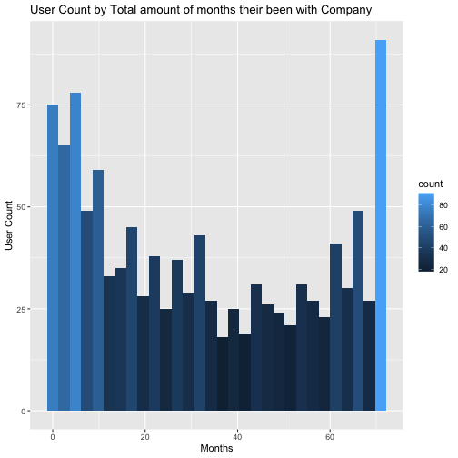
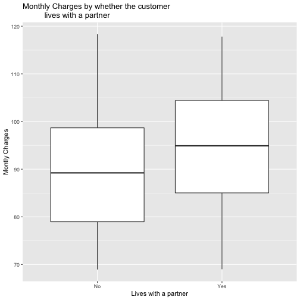
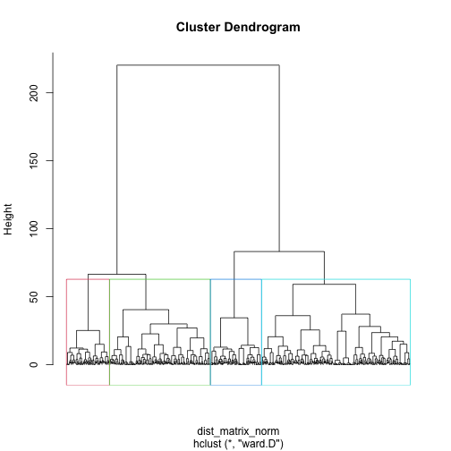
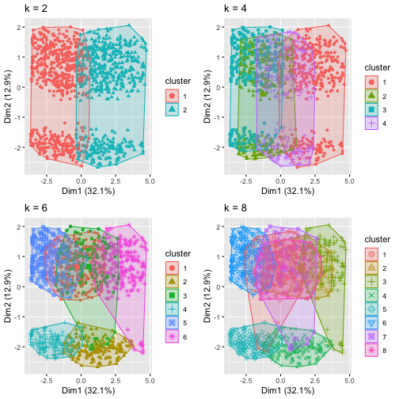
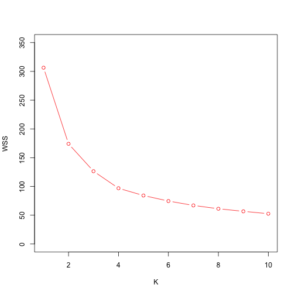

```r
### import libraries
library(stats)
library(factoextra)
library(ggplot2)
#a) 
telco_data <- read.csv("TelcoData.csv")
var_names <- c("Age", "Tenure.Months", "Monthly.Charges")
summary(telco_data[,var_names])
```

```
##       Age        Tenure.Months   Monthly.Charges 
##  Min.   :19.00   Min.   : 1.00   Min.   : 68.95  
##  1st Qu.:35.00   1st Qu.: 9.00   1st Qu.: 80.60  
##  Median :51.00   Median :29.00   Median : 91.25  
##  Mean   :50.48   Mean   :32.36   Mean   : 91.34  
##  3rd Qu.:67.00   3rd Qu.:56.00   3rd Qu.:100.55  
##  Max.   :80.00   Max.   :72.00   Max.   :118.35
```

```r
# Age -> Mean: 50.48, Min: 19, Max:80
# Age is skewed toward Max, which makes sense because 
# adults and parents pay bills most of the time
# Tenure.Months -> Mean: 32.36, Min: 1, Max: 72
# Average months are 32 months which means about 3 years
# Longest months are 72 which is about 6 years. It is shorter 
# that I expected. 
# Montly.Charges -> Mean: 91.34, Min: 68.95, Max: 118.35
# Mean for Monthly charges is $91 which is pretty much in 
# between min and max. 

# b) use ggplot to produce histogram for Tenure
?ggplot
ggplot(data = telco_data, aes(x= Tenure.Months, fill = ..count..)) + 
  geom_histogram(alpha=1) + 
  ggtitle("User Count by Total amount of months their been with Company") + 
  labs(x = "Months", y = "User Count")
```

```
## `stat_bin()` using `bins = 30`. Pick better value with `binwidth`.
```



```r
##The histogram is skewed toward the both side of the graph. 
# There is a lot of user count in the first couple of months but 
# gradually decrease when we go towards the middle, and go back up 
# again as we pass the midpoint. 

# c)
ggplot(data = telco_data, aes(x= Partner_cat, y = Monthly.Charges, 
                              group = Partner_cat )) + 
  geom_boxplot(outlier.colour="orange", outlier.shape=2, outlier.size=3) + 
  ggtitle("Monthly Charges by whether the customer 
          lives with a partner") + 
  labs(x = "Lives with a partner", y = "Montly Charges")
```



```r
# The mean value for monthly charges is higher for customers 
# who lives with his or her partner. There are no outliers. 

# d)
# Monthly Charges,Total charges, age, Tenure.Months, and Partner
# exclude customer id and partner_cat for the cluster analysis

# e) Assess where you need to normalize the data. 
# YES we need to normalize the data because
# 1. We are dealing with different data types 
# 2. Total Charges have larger numbers than any other ones. 

min_max_norm = function(x){
  return ((x - min(x))/(max(x) - min(x)))}

telco_norm <-telco_data
norm_column <- c(2:15)
telco_norm[, norm_column] <- apply(telco_norm[, norm_column], MARGIN = 2, FUN = min_max_norm)

### Hierarchical Clustering

# f) Generate distance matrix
dist_matrix_norm <- dist(telco_norm[, norm_column], method = "euclidian")
View((as.matrix(dist_matrix_norm)[1:5, 1:5]))


# g) Run hierarchical clustering

hc <- hclust(dist_matrix_norm, method = "ward.D")

# h) Plot the dendrogram
plot(hc, hang = 0, labels = FALSE)

# i) use rect.hclust to draw 
rect.hclust(hc, k = 4, border = 2:5)
```



```r
# j) cut the dendogram into 4 clusters
hc_4 <- cutree(hc, k = 4)
table(hc_4)
```

```
## hc_4
##   1   2   3   4 
## 171 337 497 144
```

```r
# Cluster 1: 171
# Cluster 2: 337
# Cluster 3: 497
# Cluster 4: 144


# k)
telco_data$hc_4 <- hc_4
library(plyr)
?ddply
ddply(telco_data, .(hc_4), summarize, n = length(CustomerID), 
      Partner = sum(Partner) / n, senior_citizen = sum(Senior.Citizen) / n,
      online_backup = sum(Online.Backup) /n, tech_support = sum(Tech.Support) / n, 
      streaming_movies = sum(Streaming.Movies) / n, 
      streaming_tv = sum(Streaming.TV) /n, 
      online_security = sum(Online.Security) / n, 
      unlimitated_data = sum(Unlimited.Data) /n, 
      Montly_mean=mean(Monthly.Charges), tenure_mean=mean(Tenure.Months), 
      age_mean = mean(Age))
```

```
##   hc_4   n   Partner senior_citizen online_backup tech_support streaming_movies streaming_tv
## 1    1 171 0.3742690    0.988304094     0.2456140   0.05847953        0.3567251    0.4210526
## 2    2 337 0.6765579    0.005934718     0.7299703   0.48664688        0.7418398    0.7982196
## 3    3 497 0.3259557    0.034205231     0.2273642   0.18712274        0.4305835    0.4144869
## 4    4 144 0.6458333    0.986111111     0.6250000   0.36111111        0.7986111    0.7222222
##   online_security unlimitated_data Montly_mean tenure_mean age_mean
## 1      0.05263158        0.8713450    82.81959    18.10526 72.12865
## 2      0.42729970        0.8872404   101.64332    51.38279 41.23739
## 3      0.19114688        0.8370221    84.62746    19.43260 42.97988
## 4      0.43750000        0.8055556   100.53611    49.36806 72.29861
```

```r
### K-means Clustering
set.seed(123)
# I) Run four different versions of k-means clustering
library(gridExtra)
k2 <- kmeans(telco_norm[, norm_column], centers = 2, nstart = 15)
k4 <- kmeans(telco_norm[, norm_column], centers = 4, nstart = 15)
k6 <- kmeans(telco_norm[, norm_column], centers = 6, nstart = 15)
k8 <- kmeans(telco_norm[, norm_column], centers = 8, nstart = 15)

# m) use fviz_cluster to visualize
p2 <- fviz_cluster(k2, geom = "point", data = telco_norm[, norm_column]) + ggtitle("k = 2")
p4 <- fviz_cluster(k4, geom = "point", data = telco_norm[, norm_column]) + ggtitle("k = 4")
p6 <- fviz_cluster(k6, geom = "point", data = telco_norm[, norm_column]) + ggtitle("k = 6")
p8 <- fviz_cluster(k8, geom = "point", data = telco_norm[, norm_column]) + ggtitle("k = 8")
grid.arrange(p2, p4, p6, p8, nrow = 2)
```



```r
# k = 2 looks the most appropriate because it has lowest overlap. 
# When k > 2 clusters have too much overlap. 

# n) find out appropriate cluster by computing WSS
WSS_curve <- c()
for (n in 1:10){
  k = kmeans(telco_norm[,var_names], centers = n, nstart = 10)
  wss = k$tot.withinss
  WSS_curve[n] <- wss
} 
plot(1:10, WSS_curve, type = "b", col = "red", ylab = "WSS", xlab = "K", ylim = c(0,350) )
```



```r
# o) run again k-means using the number of clusters you decided in n
```

